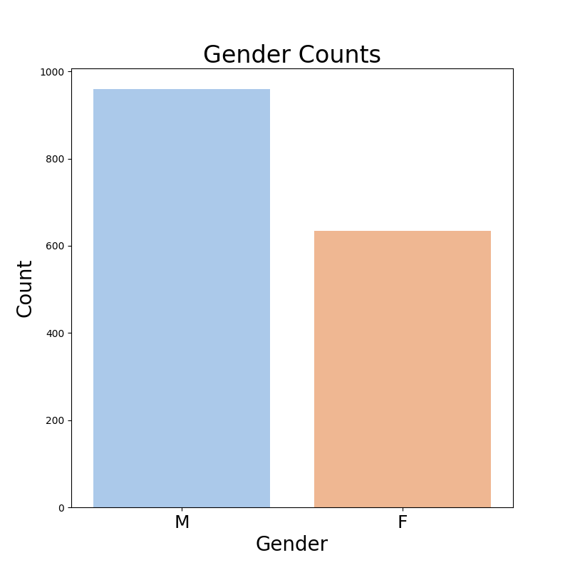
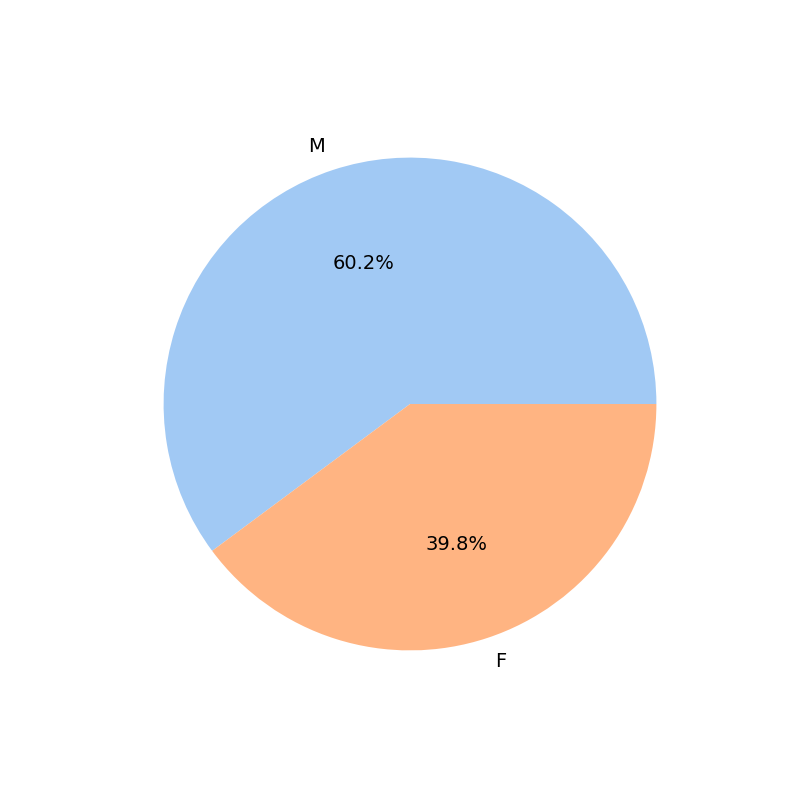
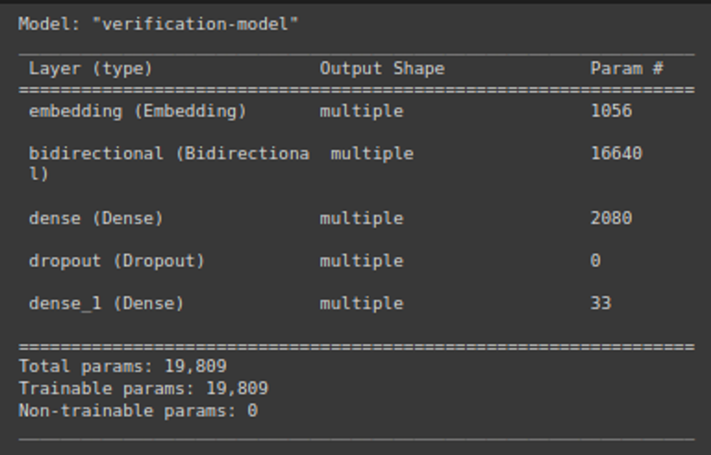
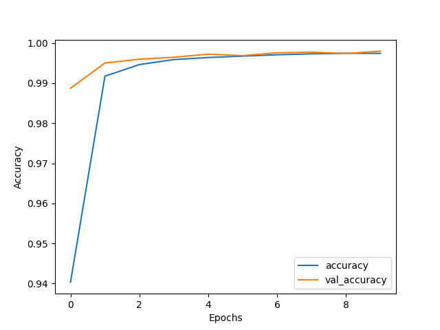
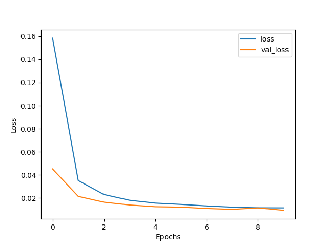
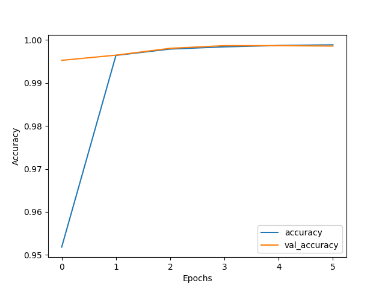
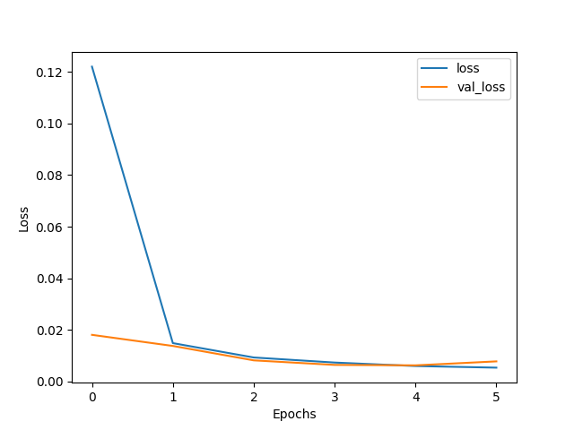
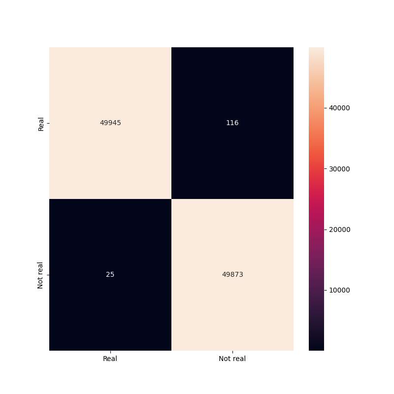

# Name Verification
Name verification is the process of detecting if the entered arabic triple name is real or not.

## How to build the docker image?

1. you can download the project and use the following command
```
$ docker-compose up
```

## How to use the solution?

The API hosted on: `https://0.0.0.0:8000` on the host or in the container <br>
You can test it using one of the following ways:
1. Use the predifined tests on `/tests/test_API.py`:
    ```
    $ pytest <project-path>/tests/test_API.py
    ```
2. Run the `/API/client.py` and enter the names yourself 
    ```
    $ python <project-path>/API/client.py
    ```

3. Using curl
    ```
    curl -X 'POST' \
    'http://0.0.0.0:8000/is_real_name/' \
    -H 'accept: application/json' \
    -H 'Content-Type: application/json' \
    -d '{
    "name": "حسام اسعد رجب"
    }'
    ```
4. Or go to the automaticly generated documentation from FastAPI at `https://0.0.0.0:8000/docs` you can see the API documentation and test it.


## How to verify the result ?

- You can verfiy the results using one of the last ways to test the app, or use predifined tests in `test/test_API`
- You can install all requirements in `requirements.txt` and go throw the notebook, I designed the notebook in such a way that each section can be run independently.

<br>

# More about the project

## Dataset
I have 3 dataset

1. `Arabic_names.csv` : contains males and females names
2. `fnames.txt` : contains females names only
3. `mnames.txt` : contains males names only


## Project structure
```
.
├── requirements.txt              <!--- Requirements --->
├── docker-compose.yml
├── Dockerfile
├── README.md
├── src                           <!--- The main package --->
│   ├── __init__.py
│   ├── data                      <!--- The package that conatins all modules used in data exploring, preprocessing, visualizing and generating --->
│   │   ├── __init__.py           
│   │   ├── explorer.py
│   │   ├── generatedata.py
│   │   ├── preprocess.py
│   │   └── viualize.py
│   └── models                     <!--- The package that conatins all modules used in training model --->
│       ├── __init__.py
│       ├── evaluator.py
│       ├── model.py
│       ├── prediction.py
│       └── tokenizer.py
├── notebooks                      <!--- Notebooks --->
│   └── Name-Verification.ipynb
├── API                            <!--- API server and client --->
│   ├── client.py
│   └── server.py
├── data                           <!--- Datasets --->
│   ├── processed                  <!--- Processed data --->
│   │   ├── final_data.csv
│   │   ├── fm_names.pkl
│   │   ├── processed_data.csv
│   │   ├── test_labels.pkl
│   │   ├── test_padded.pkl
│   │   ├── train_labels.pkl
│   │   ├── train_padded.pkl
│   │   ├── valid_labels.pkl
│   │   └── valid_padded.pkl
│   └── raw                        <!--- Raw data --->
│       ├── Arabic_names.csv
│       ├── fnames.txt
│       └── mnames.txt
├── models                         <!--- Saved models --->
│   ├── history_v1.pkl
│   ├── history_v2.pkl
│   ├── history_v3.pkl
│   ├── model_v1.pkl
│   ├── model_v2.pkl
│   └── model_v3.pkl
├── reports                        <!--- Generated reports throw the project --->
│   ├── training.csv
│   └── figures
│       ├── accuracy.png
│       ├── confusion_matrix.png
│       ├── gender_counts.png
│       ├── gender_percentage.png
│       └── loss.png
│
└── tests                           <!--- Test package to test app methods using pytest--->
    ├── conftest.py
    ├── fake_data.csv
    ├── pytest.ini
    ├── test_API.py
    ├── test_data.py
    └── test_tokenizer.py
```


## The project pipline
I designed the notebook in such a way that each section can be run independently.

### 1. Data cleaning and combining
I have 3 dataset

1. `Arabic_names.csv` : contains males and females names
2. `fnames.txt` : contains females names only
3. `mnames.txt` : contains males names only

Steps
1. First load and combine these data together.
2. The data contains alot of duplicated raws and wrong names like `سعيدة بضم السين` so I should drop them.
3. There are some compound names (names that consist of two parts) like `أم كلثوم`, so splitting these parts with a space would result on getting the first part of the compund name as the full name, the approach that will be used to handle this problem is to replace the space between the two parts of the compound name with `-` and treat the compound name as a one word.
4. There are some names that are considered male or female names so I saved them to care about while generating the wrong data

  


     
### 2. Data Generation
The arabic name structure consist of `Male or female name` + `Male name(father's name)` + `Male name (grandpa's name)`

- I will generate 2 million correct random names using these steps:
    - Get random male or female name
    - Get random male name
    - Get random male name
    - Combine these names together
- I will generate 2 million wrong random names using these steps:
    - 50% of the data consist of wrong names
        - Get random male or female name and change a letter randomly
        - Get random male name and change a letter randomly
        - Get random male name and change a letter randomly
        - Combine these names together
    - 20% of the data consist of `Male or female name` + `Male name`   + `Female name`  <!- Wrong name structure ->
    - 20% of the data consist of `Male or female name` + `Female name` + `Male name`    <!- Wrong name structure ->
    - 10% of the data consist of `Male or female name` + `Female name` + `Female name`  <!- Wrong name structure ->
- There were some repeated rows so I dropped them


### 3. Modeling

#### Preprocessing

- spliting the data into 99% training set, 0.5% for validation 0.5 for testing
    - Training   set size:  3798415
    - Validation set size:  99958
    - Testing    set size:  99958

- Creating a tokenizer to convert names to sequence of numbers
    - I will work on letters level so I mapped each letter to number
    - In arabic words there are some letters that is commonly typed in different forms but mean the same letter, this inconsistency should be solved to map the letters that are used interchangeably to only one number like `ا, أ, إ ,آ` > `1`
    - Padded all sequences to the longest name
    - I created my own tokenizer for two reasons:
        - work on letters levels and map more than letter to the same number as mentioned above
        - I will use it in prediction it's faster than than importing pad_sequences from tensorflow and use it.


#### Model

- Used Embedding Layer and Bidirectional LSTM Layer
- Used some callbacks:
    - Created a DetectOverfitting callback to stop training if val_loss/loss > threshold
    - EarlyStopping to save the best weights and stop if the model loss doesn't improve for 3 epochs
    - CSVLogger to log training results into csv file
- Used `Adam` Optimizer and `binary_crossentropy` loss function



#### Evaluation
- model_v1 (Before mapping some letters to same numbers):
    - The model achieved high accuracy but failed to deal with letters that used interchangeably like `اسلام` and `إسلام`
    - So I decieded to map these letters to the same numbers as mentioned above

- model_v2:
    - The model achieved high accuracy
    
        
        
        

- model_v3:
    - The model achieved good results
    
        
        
        


## Results

The model 
- works well with single names like `حسام` `وليد`
- can classify names as real names even if they weren't in the dataset like `اسماعيل` `السيد` `دعاء`
- detects that `دعاء` is a female name, it predicts that `دعاء محمد` as correct name but `محمد دعاء`  or `محمد حسام دعاء` as wrong name
- it detects that `اسماعيل` as male name it predicts that `اسماعيل محمد`, `محمد اسماعيل`, `محمد حسام اسماعيل` as correct name
- can't predict some names like `هويدا` and `وحيد`
- works well with double names and triple names
- can detect the name is real even if it has some wrong letters or added letters. 


## Conclusion
- The model works well in general, it detects the pattern of some new names, but the dataset should contains more names
- When generating the wrong names, We have to add more worng names of diffrent length, more small names.

## Dependencies
- Python
- numpy
- pandas
- matplotlib
- Scikit-learn
- Tensorflow
- PyTest
- FastAPI
- Docker    
